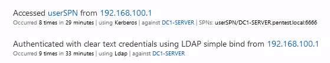

# AD Enum

**AD Enum** is a pentesting tool that allows to find misconfiguration through the protocol LDAP and exploit some of those weaknesses with Kerberos. 


```

   █████╗ ██████╗     ███████╗███╗   ██╗██╗   ██╗███╗   ███╗
  ██╔══██╗██╔══██╗    ██╔════╝████╗  ██║██║   ██║████╗ ████║
  ███████║██║  ██║    █████╗  ██╔██╗ ██║██║   ██║██╔████╔██║
  ██╔══██║██║  ██║    ██╔══╝  ██║╚██╗██║██║   ██║██║╚██╔╝██║
  ██║  ██║██████╔╝    ███████╗██║ ╚████║╚██████╔╝██║ ╚═╝ ██║
  ╚═╝  ╚═╝╚═════╝     ╚══════╝╚═╝  ╚═══╝ ╚═════╝ ╚═╝     ╚═╝


usage: EnumADAuth.py -d [domain] -u [username] -p [password]

Pentest tool that detect misconfig in AD with LDAP

optional arguments:
  -h, --help       show this help message and exit
  -d  [domain]     The name of domain (e.g. "test.local")
  -u  [username]   The user name
  -p  [password]   The user password
  -ip [ipAddress]  The IP address of the server (e.g. "1.1.1.1")
  -j               Enable hash cracking (john)
  -jp [path]       John binary path
  -w  [wordList]   The path of the wordlist to be used john (Default: /usr/share/seclists/Passwords/Leaked-Databases/rockyou.txt
  -v, --version    Show program's version number and exit
  -s               Use LDAP with SSL
``` 

## Requirement 

- Impacket (https://github.com/SecureAuthCorp/impacket)
- John (https://github.com/openwall/john)
- Python 3 
- If you are using **debian** or **kali**:
	```bash
	$ sudo apt-get install libsasl2-dev python-dev libldap2-dev libssl-dev
	```
- pip3:
	```bash
	$ pip3 install -r Requirements.txt
	```
## Features and Functionality 
### LDAP:

- Enum Domain Admin users
- Enum Domain Controllers
- Enum Domain users with Password Not Expire
- Enum Domain users with old password
- Enum Domain users with interesting description
- Enum Domain users with not the default encryption
- Enum Domain users with Protecting Privileged Domain Accounts

### Kerberos:

- AS-REP Roastable
- Kerberoastable
- Password cracking with john  (krb5tgs and krb5asrep)

## Demo 
[](https://asciinema.org/a/362017?autoplay=1)

## Microsoft Advanced Threat Analytics

ATA detects two suspicious events but does **not** trigger an **alert**:
- The connection with the protocol LDAP without SSL
- The Kerberoastable attack 

As shown in this screenshot:



## Source 
Documentation:
- https://labs.f-secure.com/blog/attack-detection-fundamentals-discovery-and-lateral-movement-lab-1/
- https://theitbros.com/ldap-query-examples-active-directory/
- https://docs.microsoft.com/en-us/advanced-threat-analytics/what-is-ata

Impacket:
- https://github.com/SecureAuthCorp/impacket/blob/master/examples/GetNPUsers.py
- https://github.com/SecureAuthCorp/impacket/blob/master/examples/GetUserSPNs.py
